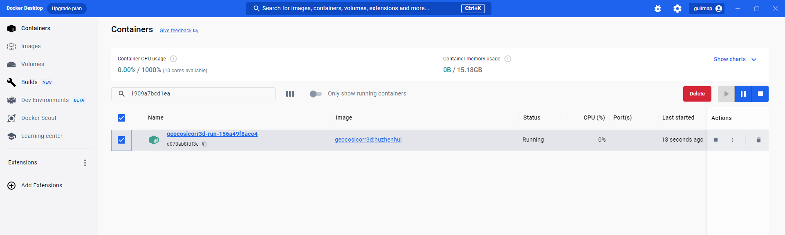

# 1. 安装Windows Docker Desktop
# 2. 加载镜像

#### 1.下载"geocosicorr3d.tar"文件
#### 2. 管理员权限启动"Windows PowerShell"，执行
 ```
    docker load -i  geocosicorr3d.tar
    docker tag 1909a7bcd1ea geocosicorr3d:huzhenhui
    docker-compose -f  docker-compose.yml run geocosicorr3d
 ```
 #### 3. 启动成功后可在【Windows Docker Desktop】中查看对应容器

 